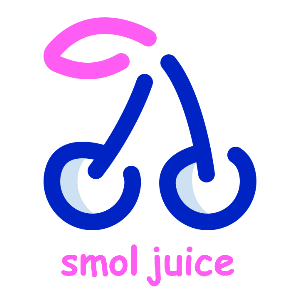

Unity asset that provides juicy feedbacks to improve the gamefeel of your game.

## BEHAVIORS

### POP

Uses tweens to change the scale in and out of a game object.


* IN TIME - Duration in secconds that the game object will take to scale in.
* IN EASE - Ease function that will be used to scale in.
* OUT TIME - Duration in secconds that the game object will take to scale out.
* OUT EASE - Ease function that will be used to scale out.
* WAIT TIME - Duration in secconds that the game object will wait between scale in and scale out.
* MODE - Relative (CURRENT SCALE += NEW SCALE) or absolute (CURRENT SCALE = NEW SCALE). 
* SCALE - Scale used to scale in.

### SHAKE

Shake a game object.


* TIME - Duration of the shake in seccond.
* MAGNITUDE - How strong the shake will be.
* FADE - If enabled the shake will stop gradually.

### FLASH

Change the color of a game object.


* COLOR - The color that the game object will change for.
* BRIGHTNESS - How strong the color will be.
* IN TIME - Duration in secconds to fade in the color.
* WAIT TIME - Duration in secconds to wait between fade in and fade out.
* OUT TIME - Duration in secconds to fade out the color.

### SOUND 

Play a sound.

* AUDIO CLIP - Clip of the sound that will be played.
* VOLUME - Volume of the sound.
* MONO - If enabled, only one sound at a time.

## METHODS

### START JUICE

Start a selected juice.

```
SmolJuice.Start(gameObject, order);
```

* gameObject -> The game object that you want to start the juice. (NOTE THAT THIS GAME OBJECT MUST HAVE A JUICE COMPONENT)
* order -> The order from up to down of the component in the game object's inspector. (ONLY RELATED TO OTHERS JUICE COMPONENTS) You can leave this empty if your game object only has one juice component.

### STOP JUICE

Stop a current active juice.

```
SmolJuice.Stop(gameObject);
```

* gameObject -> The game object that you want to stop the juice. (NOTE THAT THIS GAME OBJECT MUST HAVE A JUICE COMPONENT)

## NAMESPACE

If you want to access the juice component you must use the namespace called "SmolTools".

## HOW TO USE

* Add a juice component to a game object.
* Set the parameters as you like.
* Start the juice through code...
```
SmolJuice.Start(gameObject);
```
...and that's it!

Asset Store Link http://u3d.as/1TZC

Icon made by Freepik from www.flaticon.com
